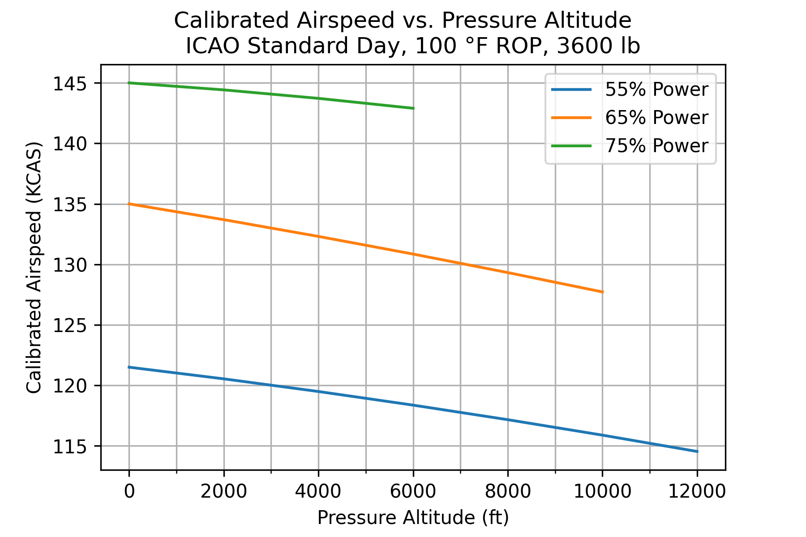

# Open Aircraft Performance

This repository contains a growing collection of models I am developing from Piper and Lycoming performance charts.

  

## Goals

1) To answer questions about and gain insights on my own aircraft's performance.
2) To document my methodology for developing these models and digitizing performance charts.
3) To develop an interface (think iOS app) to use these models in the cockpit.
