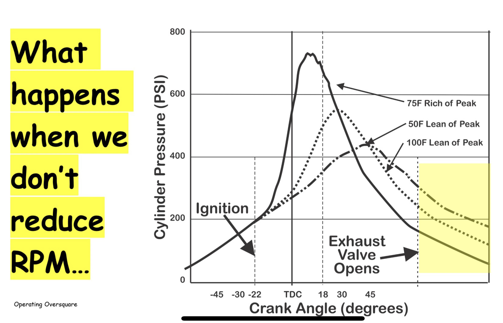

## Understanding Ignition Timing

### Assertions

- **Retarded Ignition** – High EGTs, because the peak pressure point is occuring closer to the exhaust valve opening, so we're translating less potential energy into mechanical energy
- **Retarded Ignition** – Low chance of detonation, since peak pressure is occuring much later than TDC
- **Retarded Ignition** – At high RPM, a backfire (combustion taking place in the exhaust) can occur

### Questions 

- As you get into LOP fuel-air ratios, without touching RPM, you'd think EGTs would get higher. Is it that they **do** get higher, without a corrresponding drop in RPM?
- Lowering RPM gives more time to extract energy from each combustion event, hence, lowering EGTs. However, for best power, this seems dangerous? Aren't we increasing potential for detonation by moving the peak pressure point closer to TDC?

## Understanding Engine Operation

Mike Busch says that carbuerated engines, like the O-540 specifically, can run mildly lean of peak.

> They have decent mixture distribution, and that's a good place for them, so long as they're smooth.

> Use a partial bit of carbeurator heat, which arms the air, improving the atmoization of the fuel.

> Instead of operating at absolute, WOT, pull back until the very first slight indication of a reduction in MAP. Cock throttle butterfly, just enough, to cause turbulence as air is going through the carberuator. Little turbulence, little heat, considerable difference. Still not great, but it improves it enough to operate LOP.

So, why would you advise against it?

### Assertions
- Rich of Peak, the energy released by combustion is porportional to the weight of the charge.
- Lean of Peak, the energy is porportional to fuel flow.

### Questions
- The POH says there's one fuel flow that fits all 65% best power (e.g.). But that doesn't make sense. ROP, it's porportional to the weight of the charge, so fuel flow would be different depending on different MP / RPM combinations.
- LOP, it makes more sense, right? If energy is porportional to fuel flow, then it's all the same fuel flow.

- As long as CHTs are below 380 F, we should be good to go, right?
- Full rich leads to really dirty engine operation, but running too lean doesn't do anything, right? It's just temperatures, and engine smoothness we're worried about?

## My Engine Operation Strategy

Fly a particular airspeed, as close to WOT/low RPM/best economy mixture without allowing CHTs to exceed 380 F.

## Wishlist Questions

Mike Busch says that engine manufacture guidelines are predicated on ROP operation–LOP you can go even FURTHER over square.

> Even without an engine monitor, operating oversquare would help ensure CHTs stay low, but you really should have an engine monitor.